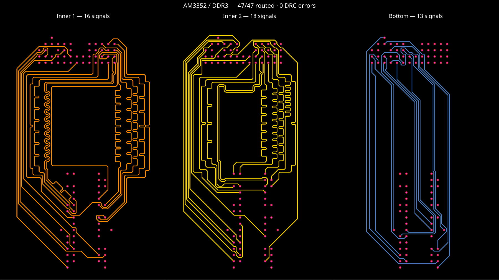

# @tscircuit/bus-lanes-solver

Step-based, via-free bus routing for `SimpleRouteJson`, with `BaseSolver` and `GenericSolverDebugger` from `@tscircuit/solver-utils`.

```ts
import { BusLanesSolver } from "@tscircuit/bus-lanes-solver"

const solver = new BusLanesSolver(simpleRouteJson)
solver.solve()
if (solver.failed) throw new Error(solver.error!)
const routed = solver.getOutput()
```

Each connection must have exactly two terminals on the same fixed layer. The solver never emits vias, changes terminal layers, or falls back to a multilayer router. Existing copper and obstacles remain fixed. Geometric winding sweeps, seam rotations and reverse searches choose lane order; planar congestion, crossed lane orders, unsupported constraints, and exhausted search budgets produce explicit failures. A bounded visibility-graph search failure is not a proof that no continuous planar solution exists.

## Review target

The integrated preset routes the original TSX from the
[AM3352/RAM reference](https://tscircuit.com/seveibar/am3352-ram-dogbone-and-single-layer-route-test)
with its custom algorithms replaced by `autorouter="bus_lanes"` in
[core #4237](https://github.com/tscircuit/core/pull/4237). All 47 signals are computed
from pads, obstacles, and constraints. No saved route plan is replayed.



Acceptance requires zero DRC errors, via-free interconnects after local escapes,
short ordinary runs with few direction changes, no self-touching copper or acute
reversals, smooth length-tuning curves, coupled pair shapes, and the declared bus
and pair skew limits. The existing four DDR benchmarks alone do not establish
this result.

The AM3352 regression measures these limits independently of the solver:

| Measurement | Reviewed reference | Generated result | Regression limit |
| --- | ---: | ---: | ---: |
| Connected signals / native DRC errors | 47 / 0 | 47 / 0 | 47 / 0 |
| Total planar copper | 1696.53 mm | 1549.71 mm | ≤1700 mm |
| Maximum / mean detour ratio | 2.536 / 1.723 | 2.047 / 1.546 | ≤2.6 / ≤1.75 |
| Ordinary turns / short jogs | 888 / 451 | 540 / 145 | ≤900 / ≤460 |
| Acute corners | — | 0 | 0 |
| Byte-bus / maximum differential skew | Within declared bounds | 0.635 / 0.127 mm | ≤0.635 / ≤0.127 mm |
| Pair interior edge gap | 0.11979–0.13813 mm | 0.11213–0.13813 mm | 0.0999–0.155 mm |

The pair audit allows 6.2 mm at each end for package approaches, matching the
reference audit. This is a board-specific test limit, not a hidden solver default.
The quality limits supplement connectivity, continuous DRC, and visual review.

The main review path is:

1. `bus-lanes-pipeline-solver.ts`: preserve existing fanouts; escape only untouched
   component pads; compose the routing and tuning stages.
2. `bus-lanes-solver.ts`: complete fixed-layer connections and validate the result.
3. `coupled-pair-routing.ts` and `tune-coupled-lengths.ts`: shared pair corridors
   and shared smooth meanders.
4. `refine-pair-approaches.ts`: tighten parallel approaches, replace acute
   corners with legal bevels, and continue shared pair geometry through bends.
   Refinement runs after allocating tuning space and preserves other-net copper.
5. The AM3352 TSX regression in core: 47 routes, native DRC, independent quality
   measurements, and three routed signal-layer snapshots. The fresh run passed
   in approximately 281 seconds; every snapshot was visually inspected.

## Constraints

- `buses[].connectionNames`: connections belonging to the bus, in routing order.
- `buses[].maxLengthSkew`: maximum difference in total planar copper lengths, in millimeters, including fixed traces associated by `source_trace_id` or `connection_name`. The solver adds clearance-checked tuning detours and verifies the final result.
- `buses[].traceWidth`: explicit width in millimeters; otherwise uses connection `nominalTraceWidth` / `width`, then `minTraceWidth`.
- `buses[].allowedLayers`: must contain the fixed terminal layer.
- `differentialPairs[].lengthTolerance`: supported as a routed-length constraint. Pairs with `traceGap` use a shared corridor. An explicit `maxUncoupledLength` bounds total uncoupled copper, including fixed fanouts.

Matching includes both fixed fanouts and the routes produced by this phase. It measures XY copper length; via depth, layer-dependent propagation velocity, and package delays are not inferred. No impedance or delay defaults are supplied. Matching uses the existing core SRJ fields: bus `maxLengthSkew` and differential-pair `lengthTolerance` (mapped from the JSX pair’s `maxLengthSkew`). Routes already inside the bound remain untuned; shorter routes grow only to the permitted lower bound. Overlapping bus and pair constraints are resolved together without forcing exact equality.

## tscircuit integration

The accompanying core/props changes introduce:

```tsx
<autoroutingphase name="DATA_LANES" phaseIndex={1} autorouter="bus_lanes" />
<bus
  name="DATA"
  connections={["DATA0", "DATA1"]}
  routingPhaseIndex={1}
  maxLengthSkew="0.1mm"
  pcbTraceWidth="0.15mm"
/>
```

The integrated phase adds local dogbones only for untouched component pads that need a signal-layer transition. Existing fanout handoffs retain their layers and geometry. Failed lane routing does not trigger a global-router fallback.

## Debugger

```sh
bun install
bun run start
bun run build:site
```

Cosmos shows four full AM62L DDR phase captures and a skew-tolerance example.
Each AM62L page has two separate, real `FanoutSolver` outputs and all 33 DDR
signals waiting to be routed. The enclosing regions are 17.76 mm apart, with a
4 mm transverse package offset. Fixed and newly routed copper share stable
layer colors; all layers are present at iteration zero, including via rings.
The SoC remains unrotated.

```sh
bun test
bun run typecheck
./benchmark.sh
bun run format:check
```

The repository follows the [handbook bootstrapping guide](https://github.com/tscircuit/handbook/blob/main/guides/bootstrapping-repos.md): Bun, vanilla TypeScript package exports, Biome, CI and a Vite/React Cosmos site. `vercel.json` exports Cosmos for deployment.

## DDR benchmark

`./benchmark.sh` measures four complete DDR interconnect inputs captured from
an actual `bus_lanes` phase. Every sample contains 66 fixed paths produced by
`@tscircuit/fanout-solver@0.0.78`. Input/options/output records are committed in
[`examples/fanout-solver-outputs`](./examples/fanout-solver-outputs). Tests rerun
all eight package fanouts and compare the generated paths.

Before routing, the benchmark verifies record hashes, original output geometry,
continuous wire/via joins, 33 paths per package, at least 6 mm region separation,
exact exits, and independent fixed-copper DRC. Exit-layer mismatches are reported
as routing failures, not repaired or removed from the denominator. Complete
interconnects must also pass independent combined-copper DRC.

**Current result: 4/4 full interconnects (132/132 signals), with combined-copper
DRC and length matching passing.** All four core circuit builds complete with zero circuit errors.
All three logical DDR groups in every sample request a 0.1 mm maximum skew. The measured total copper skew stays within that bound in all 12 groups; the previous routing-only samples had up to 24.7 mm skew.
The measured solves take 100–306 ms on the development machine; the benchmark
records solve time and time including output DRC separately.

FanoutSolver receives compatible handoff layers and winding guidance. The left
case locks successful SoC layer assignments, guides the strobe-pair order, and
uses a RAM corner bank for the remaining data group. Bottom escapes the SoC's
left-side ball field before turning toward its bottom boundary. Neither changes
the SoC ball positions or rotation. Every fixed path is a real saved solver
output; generated coordinates are never edited. These are routing checks, not
complete DDR timing closure or equal-transition-count claims for fixed fanouts.

Samples run one at a time in separate processes to avoid timing interference, with the solver's ordinary 200,000
iteration budget and a one-second benchmark deadline. Override the deadline with
`./benchmark.sh --timeout-seconds 2`. Timeouts and partial paths are failures.
Results are written to `benchmark-results.json`; a failed positive sample makes
the command exit nonzero. Four original mixed-layer negatives are counted separately.

The [tscircuit examples](./examples/README.md) load these exact fanouts and use
`<autoroutingphase autorouter="bus_lanes" />`. Capturing the input is separate
from solving it, so a failed router cannot hide the input that caused it.

The older 12 carrier-prefix cases remain available with `--legacy`; they are
excluded from the default score and Cosmos pages. The prior grid-generated,
aligned two-fanout data is superseded as well.

The router checks continuous copper clearance while searching octilinear paths.
Clear channels use analytic connectors. Dense inputs use a grid search with turn
penalties, negotiated congestion, geometry-derived waypoint alternatives, and
bounded candidate selection. Candidate pairs remain atomic. Search never loads a
saved route plan; package envelopes, bus membership, and existing copper determine
the alternatives. Bus corridors are routed and tuned before unrelated controls.
A search-budget failure is explicit and does not export partial successful routes.

See the [visual iteration audit](./docs/vector-routing.md) for inspected baseline
and replacement snapshots. Cosmos includes a staggered obstacle channel in
addition to all four real AM62L captures.

Future changes must be submitted through pull requests with reviewed visual snapshots for all four DDR samples. See [AGENTS.md](./AGENTS.md).

### Meander geometry

Length tuning prioritizes long runs over short terminal approaches and centers evenly pitched serpentine lobes along them. The integrated preset uses rounded curves for both individual lanes and shared pair centerlines. Lobe count scales with the required added length, spreading large corrections without turning small corrections into dense teeth. Chamfers scale with lobe dimensions instead of a fixed microscopic corner cut. Returning arms retain at least three trace widths of center-to-center spacing (and the requested copper clearance). When the shortest lanes leave no room, the router opens an octilinear central corridor in winding order and rematches all affected bus lengths. Endpoints and fixed fanouts remain unchanged.

The [routed artifacts](./docs/routed-ddr) contain complete boards. All new carrier bends in the DDR samples are checked to turn by at most 45 degrees; length matching and combined-copper DRC remain mandatory.

## Integrated local-dogbone pipeline (experimental)

`BusLanesPipelineSolver(input, { fanout: "auto" })` composes local terminal
escapes with the fixed-layer lane solver. Automatic escapes are only eligible at
component pads without an existing connected route. Supplied fanout handoffs
retain their available layers and fixed copper; a layer conflict fails rather
than adding another dogbone. This distinguishes bus completion from the preceding fanout phase.

It honors bus layer restrictions and
preferences, keeps overlapping bus/pair groups atomic, and resolves signal layers before routing the interconnects. `fanout: "none"`
retains the fixed-layer input contract. A failed pipeline emits no partial
successful trace output.

The pipeline enables smooth length tuning and dense routing search. Declared
pairs use a common corridor and shared tuning curves; skew checks include fixed
fanout copper. Ordinary-run cleanup minimizes turns without increasing length.
The strict `BusLanesSolver` export remains available for callers that already
supply fanout handoffs.

The AM3352/RAM integration regression passes without saved geometry or a custom
algorithm. Dense original-pad inputs can require minutes of negotiation; bounded
search still reports failure when no acceptable route set is found.

### Routed PR artifacts

PR images show completed routing only. The AM3352 overview above is rendered
from the three core acceptance snapshots: 16 inner1, 18 inner2, and 13 bottom
signals. Each panel shows its signal layer, with all 47 routes accounted for.
The core test writes snapshots only after connectivity, DRC, and quality checks.

Generate the four DDR artifacts with
`bun scripts/snapshot-routed-ddr.ts`; it verifies all cases solve and every
connection has a route before writing any images. Keep intermediate and failed
captures outside the repository.

- [Bottom to top](docs/routed-ddr/ddr_bottom_io_top-solved.png)
- [Left to right](docs/routed-ddr/ddr_left_io_right-solved.png)
- [Right to left](docs/routed-ddr/ddr_right_io_left-solved.png)
- [Top to bottom](docs/routed-ddr/ddr_top_io_bottom-solved.png)
