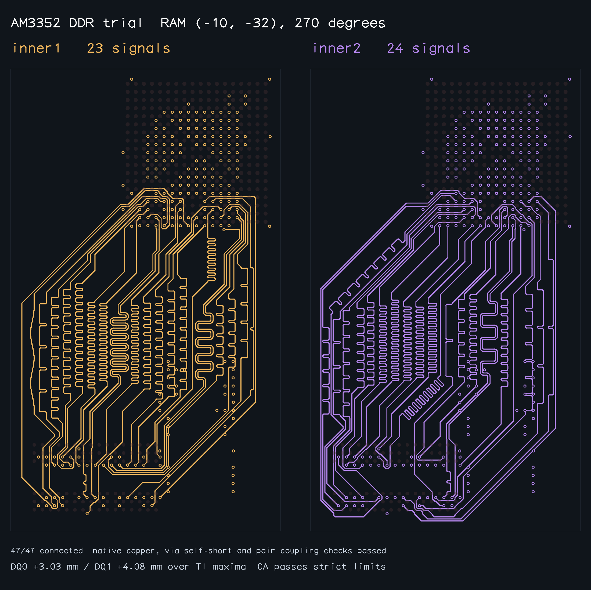

# Absolute DDR copper length bounds (work in progress)

This branch adds total-copper `minLength` / `maxLength` constraints to buses, including fixed escape copper, and preserves both length and congestion cost in bounded grid searches. A cheaper but longer prefix must not discard a shorter prefix that can finish within the remaining length budget.

The AM3352 SBC is **not yet demonstrated compliant**. A fresh 0.0.18-based pipeline run at RAM (-10,-32,270°) now connects all 47 signals, passes independent native copper DRC and the native via-land self-short check, all three timing-bus skews and all three applicable exterior pair-coupling checks. CA lengths meet strict TI bounds; byte 0 and byte 1 remain 3.03 mm and 4.08 mm over their strict maxima. This is an explicitly labelled <4.9 mm development trial, not an accepted board revision. Fixed benchmark power copper is unchanged. An isolated full-board integration regenerated all 375 power escapes and preserved all 47 DDR paths exactly, with no unexpected native clearance/placement/self-short errors. Other rail distribution and peripheral routing remain incomplete; strict data lengths still prevent board promotion.

[Independent report](rotated-trial-report.json). Reproduce from native pads and fixed power (no saved signal routes) with `bun scripts/benchmark-am3352-length-bounds.ts --rotated-sbc --allowance-mm 4.9 --timeout-seconds 300 --output rotated-trial.json`. The current portable reproduction passed in 77.895 s. Earlier 68–70 s trial artifacts are superseded: a full-board native self-short check exposed a DQS bend inside its own via pad, now rejected for newly generated approaches and covered by regression testing. Exit 3 deliberately indicates strict TI geometry was not accepted. The new local escape rebalance derives sites from native pad pitch and package edges and changes only caller-generated signal escapes.

`./benchmark.sh --require-all-solved --timeout-seconds 300 --output docs/absolute-length-bounds/benchmark-018.json` also passed all nine declared cases with the merged 0.0.18 envelope optimizer. See [raw results](benchmark-018.json) for connectivity, native DRC, copper skew, envelope and runtime. These were concurrent development runs, so timing is not an isolated performance comparison.

The snapshots below are completed runs of all nine existing benchmark samples. Each passed its declared connectivity, physical DRC, fixed-power preservation, differential-pair matching and bus-skew checks. These samples do not declare TI absolute minimum/maximum lengths: their passing status is **not DDR compliance**. The two-bus legacy samples also do not constrain the complete CA bus. The complete-CA sample declares all three buses. Every image was visually inspected; the large matching envelopes are visible and remain a problem.

| Sample | Completed snapshot |
|---|---|
| Control | [View](baseline/control-solved.png) |
| Right | [View](baseline/right-solved.png) |
| Left | [View](baseline/left-solved.png) |
| Above | [View](baseline/above-solved.png) |
| Inner layers | [View](baseline/inner-layers-solved.png) |
| Inner layers, right | [View](baseline/inner-layers-right-solved.png) |
| Inner layers, left | [View](baseline/inner-layers-left-solved.png) |
| Inner layers, above | [View](baseline/inner-layers-above-solved.png) |
| Inner layers, complete CA | [View](baseline/inner-layers-complete-ca-solved.png) |

Reproduce the gallery with `bun scripts/snapshot-routed-am3352.ts docs/absolute-length-bounds/baseline 300`. The exporter refuses to write artifacts unless all nine runs succeed and pass independent validation.

The board's custom `algorithmFn` imports a self-contained candidate bundle, with source and bundle SHA-256 provenance, supplies strict TI length bounds, and independently rejects failing timing or exterior pair coupling. The board's saved copper has not been replaced.

A stricter reproduction is `bun scripts/benchmark-am3352-length-bounds.ts --timeout-seconds 300 --output am3352-length-bounds.json`. Exit 3 means strict geometry was not accepted. `--allowance-mm 4.9` is an explicitly labelled development trial; its report still independently evaluates the original TI bounds. Failed attempts produce reports, never routed review snapshots.

Validation after 0.0.18 integration: full suite 312 pass / 0 fail; after the via-land fix, typecheck and 15 focused bound/repair/via tests pass. The corrected native-pad reproduction passes copper, connectivity, via self-shorts, coupling and all declared skew checks, but intentionally exits 3 for the two strict absolute-length failures.
