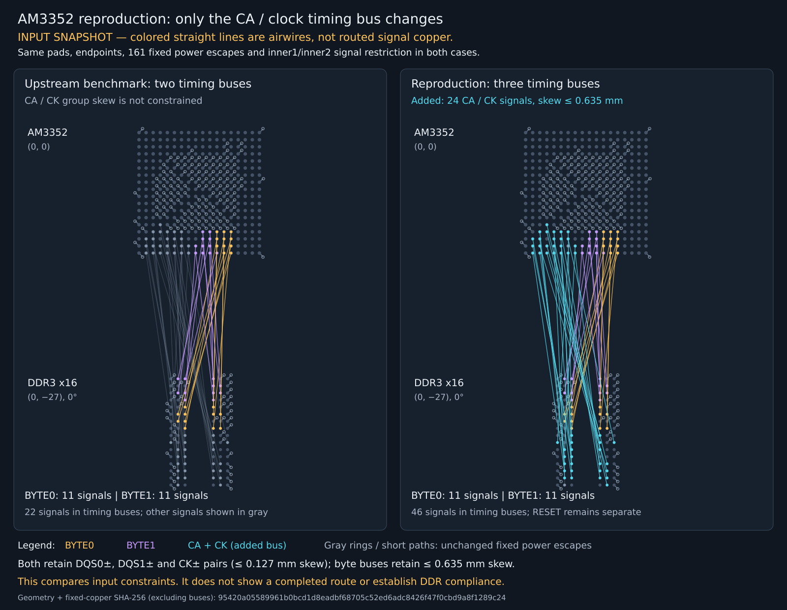
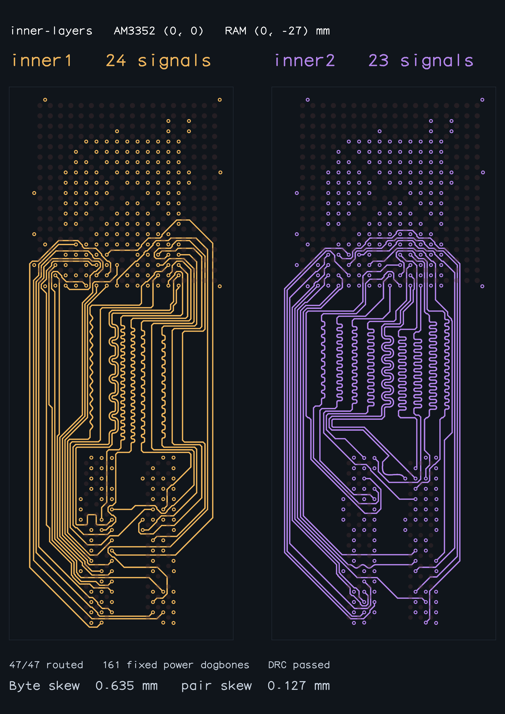

# AM3352: adding the complete address/control/clock timing bus

The existing `inner-layers` sample completes 47 signals with two byte buses and
three differential pairs. Adding a third, 24-signal address/control/clock (CA/CK)
bus to that same input exhausts the solver's iteration budget on v0.0.15.
This reproduction changes only `buses`: it retains native pad geometry, net
identities, layer restrictions, all three pairs, and 161 fixed power dogbones
with their FanoutSolver provenance. It does not change production routing code.

## Visual reproduction



This explicitly requested diagnostic shows the exact inputs side by side.
Colored straight lines are **airwires**, not routed signal copper. Gray short
paths and via rings are the unchanged physical power escapes. The added CA/CK
membership is cyan. It is not a successful-routing artifact: the three-bus case
has no completed output to show. Regenerate it with:

```sh
bun scripts/snapshot-am3352-ca-input.ts
```

For comparison, this is the existing, successfully validated two-bus baseline:



Its routing/DRC/matching pass applies to the configured two byte buses and
three pairs. It does not establish CA/clock group matching or DDR compliance.

## Which configuration is correct?

The upstream fixture is a valid **partial router benchmark**. Its constraint set
is incomplete if used as an AM3352 DDR compliance test. The SBC's grouping is
more complete, but its present routed copper fails its own timing checks.
Neither result is a verified compliant DDR board.

| Check | Upstream fixture | SBC / reproduction |
| --- | --- | --- |
| Byte 0: D0–D7, DM0, DQS0± | 11-member bus, 0.635 mm skew | Same |
| Byte 1: D8–D15, DM1, DQS1± | 11-member bus, 0.635 mm skew | Same |
| DQS0±, DQS1± and CK± | Three pairs, 0.127 mm skew | Same |
| Address/control relative to clock | No group-skew constraint | 24-member CA/CK bus, 0.635 mm skew |
| TI absolute-length limits | Not checked | Checked separately by SBC; not implemented by this reproduction |

TI SPRS717L §7.7.2.3.4 says CK and ADDR_CTRL are length matched to minimize
skew between them; §7.7.2.3.6.1 and Table 7-68 define the topology-specific
length/skew rules. The SBC uses 25 mil (0.635 mm) as a conservative whole-group
bound for its single-load case. This is an explicit modeling choice, not a
claim that every topology uses one universal whole-route constraint. Table
7-69 requires matching within each byte and to its associated strobe; it does
not require matching byte 0 to byte 1. A differential-pair constraint by itself
matches the two clock conductors, not address/control timing to that clock.

The earlier investigation incorrectly treated unpowered DDR-first trials as
equivalent to the powered upstream sample and did not clearly separate routing
success from complete DDR checks. This reproduction corrects that comparison.
The failure demonstrates a solver limitation for the specified request; it
does not prove the PCB is unroutable or substitute for electrical verification.

## Reproduce

```sh
bun install
bun scripts/repro-am3352-ca-bus.ts --timeout-seconds 120 --output /tmp/am3352-ca-repro.json
```

The command runs a baseline and the added-bus case in separate processes. It
exits **1** if either fails, times out, or fails independent acceptance checks.
An exhausted search is not an expected passing test. The JSON contains stage,
iteration count, elapsed time, immutable-input hashes, connectivity/native DRC,
and full pad-to-pad bus/pair length reports when routing completes. No failed or
intermediate routing images are exported.

The added bus contains `A0..A12`, `BA0..BA2`, `CSn0`, `CASn`, `RASn`, `WEn`,
`CKE`, `ODT`, `CK`, and `CKn` (each prefixed `DDR_`). Its maximum skew is
0.635 mm and its allowed layers are `inner1`/`inner2`. RESET remains separate.
Together with the two 11-signal byte buses, this constrains 46 of 47 signals.
The clock remains a differential pair while also belonging to its timing bus,
just as each DQS pair belongs to its byte bus.

## Observed result

Source: `c473bf328b43aa83c97574d099e9badb778dcaf5` (v0.0.15), Bun 1.4.2,
Linux x86_64, 2026-10-03. Timing is machine/load dependent.

| Case | Result | Signals | Solver time | Iterations | Final phase |
| --- | --- | --- | ---: | ---: | --- |
| Original two buses | Native DRC, connectivity and existing matching pass | 47/47 | 36.658 s | 123,267 | solved |
| Add complete CA/CK bus | `BusLanesPipelineSolver ran out of iterations` | 0/47 final routes | 114.394 s | 800,000 | route_shared_layers |

Both cases report unchanged input and fixed power copper. Their hashes excluding
only `buses` are identical:
`95420a05589961b0bcd1d8eadbf68705c52ed6adc8426f47f0cbd9a8f1289c24`.
The passing baseline has BYTE0/BYTE1 total copper skews of 0.635/0.635 mm
(within floating-point epsilon); CA/CK group skew is not constrained in it.
DQS0/DQS1/CK pair skews are 0.077868/0.126884/0.127000 mm.
A separate run reproduced the added-bus failure at the same 800,000 iterations.

The existing benchmark demonstrates routing in multiple placements. It does not
demonstrate matching the complete CA/CK group or meeting TI absolute lengths.
The failing case here is a valid supported bus request; exhausting a search does
not prove the layout is impossible.

## Relationship to the SBC investigation

At RAM `(0, -27, 0 degrees)`, the SBC experiment has the same 420 BGA pad
geometries (rounded to 5 decimal places) and all 94 signal endpoints agree within
1e-12 mm. Its actual routing input still differs: it omits power escapes during
DDR-first placement exploration, has wider board bounds, additional peripheral
obstacles, and extra connectivity aliases. It must not be called equivalent to
the powered benchmark.

In a separate diagnostic, removing only `input.traces` from the original powered
`inner-layers` sample, leaving its two buses and all other fields unchanged,
timed out at 120 s in `lanes_route` (592,332 iterations, no final routes).
Thus omitted power copper also changes search behavior; the CA bus is not a
complete explanation of every SBC trial. This PR isolates the CA failure using
the unmodified powered reference instead of importing the SBC's larger input.

## Acceptance scope

The 0.635 mm CA/CK bound is the SBC's conservative single-load interpretation of
[TI SPRS717L, Table 7-68](https://www.ti.com/lit/ds/symlink/am3352.pdf).
Table 7-69 covers each byte and its associated strobe. This reproduction checks
relative skew, not the complete electrical specification. It intentionally does
not add absolute-length limits unsupported by the bus API. TI length ceilings
and nominal windows, stackup/impedance, return paths, package/via delays, and
signal integrity remain separate board acceptance requirements.

For a completed added-bus result, the runner retains the native benchmark's
connectivity, combined copper DRC, fixed-fanout provenance, byte/pair matching,
and pair-coupling audits, then independently checks all three bus skews.
All measurements include fixed escapes and new interconnect. A routing-only
success cannot pass this runner.

## Benchmark review artifacts

The eight existing successful routed snapshots were individually inspected.
They describe the original two-bus benchmark, not a successful CA reproduction.
The requested input diagnostic above is separately labeled and is not counted
as a successfully routed artifact.

| Placement | Automatic signal layers | Inner1/inner2 only |
| --- | --- | --- |
| Below | [Control](routed-am3352-placements/control-solved.png) | [Below](routed-am3352-placements/inner-layers-solved.png) |
| Right | [Right](routed-am3352-placements/right-solved.png) | [Right](routed-am3352-placements/inner-layers-right-solved.png) |
| Left | [Left](routed-am3352-placements/left-solved.png) | [Left](routed-am3352-placements/inner-layers-left-solved.png) |
| Above | [Above](routed-am3352-placements/above-solved.png) | [Above](routed-am3352-placements/inner-layers-above-solved.png) |

Run the unchanged full benchmark with:

```sh
./benchmark.sh --timeout-seconds 120 --require-all-solved --output /tmp/am3352-benchmark.json
```

An initial run with the default 60 s deadline completed 6/8 cases here:
`inner-layers-left` produced 47 routes at 61.775 s but exceeded the deadline,
and `inner-layers-above` timed out at 60 s without a completed output. Neither
was counted as a pass. The rerun below uses 120 s per sample to distinguish
machine-speed timeouts from solver/validation failures.

Fresh benchmark results (120 s limit; all eight pass):

| Sample | Signals | Native DRC | BYTE0 / BYTE1 skew (mm) | DQS0 / DQS1 / CK skew (mm) | Solver time | Including validation |
| --- | --- | --- | --- | --- | ---: | ---: |
| control | 47/47 | Pass | 0.635000 / 0.635000 | 0.077868 / 0.126884 / 0.072830 | 20.836 s | 22.540 s |
| right | 47/47 | Pass | 0.635000 / 0.635000 | 0.096047 / 0.121802 / 0.102644 | 18.949 s | 20.842 s |
| left | 47/47 | Pass | 0.635000 / 0.635000 | 0.010514 / 0.127000 / 0.105429 | 26.653 s | 30.918 s |
| above | 47/47 | Pass | 0.635000 / 0.635000 | 0.127000 / 0.127000 / 0.127000 | 35.803 s | 38.944 s |
| inner-layers | 47/47 | Pass | 0.635000 / 0.635000 | 0.077868 / 0.126884 / 0.127000 | 36.128 s | 37.892 s |
| inner-layers-right | 47/47 | Pass | 0.635000 / 0.635000 | 0.123649 / 0.127000 / 0.127000 | 45.804 s | 47.515 s |
| inner-layers-left | 47/47 | Pass | 0.635000 / 0.635000 | 0.127000 / 0.127000 / 0.105429 | 61.064 s | 65.904 s |
| inner-layers-above | 47/47 | Pass | 0.635000 / 0.635000 | 0.127000 / 0.127000 / 0.127000 | 83.875 s | 88.021 s |

Validation: `bun run typecheck` and seven focused fixture/output/snapshot tests
pass (33 assertions). The full CA reproduction exits 1 as recorded above.
