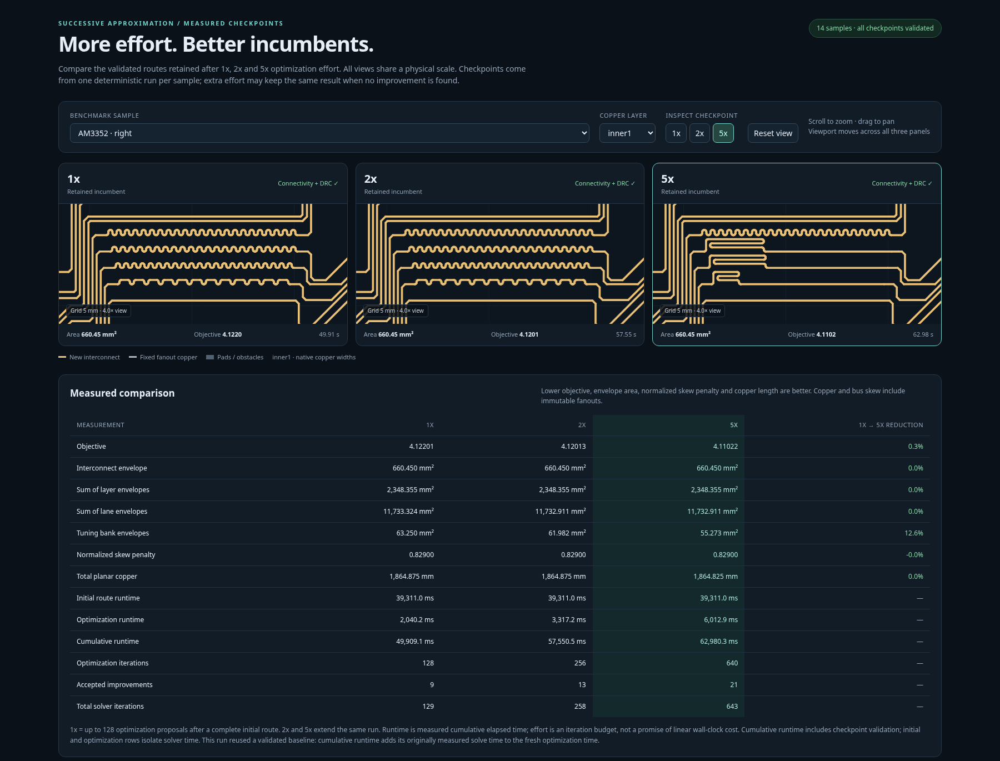

# Successive approximation for bus lanes

The new `AnytimeBusLanesSolver` retains a valid incumbent and searches progressively denser tuning shapes. A 1x run is the prefix of a 2x or 5x run: increasing effort continues the same deterministic search, and the accepted objective cannot increase.

[Open the interactive comparison](index.html), select a sample and copper layer, then zoom or pan any panel to inspect all three efforts at the same physical scale. The report contains the exact, full-precision routed geometry and works offline in a browser supporting `DecompressionStream`.



[View the complete placement and measurements](comparison.png).

## Algorithm

1. Immediately return provisional endpoint connections with `status: "best_effort"` and explicit violations. Route the first legal incumbent with the existing bus-lanes pipeline, preserving supplied fanouts and local escapes.
2. Identify the length-tuning banks and propose rounded or folded raster replacements. Search cell count, longitudinal span and placement, side, bend radius, and added length. Try length-preserving forms first, then small length reductions and ordinary-run shortcuts. Shared differential banks change both offset rails together.
3. Rebase proposals onto the latest incumbent so accepted changes to different lanes accumulate. Reject proposals whose weighted score does not improve or whose bus/pair lengths fall outside tolerance.
4. Validate the changed copper and its differential partner against all immutable copper and the other accepted lanes. Apply the original lane, clearance, self-clearance, corner, coupling and exterior pair-spacing checks. Only an accepted proposal can replace the incumbent.
5. Yield between discovery/trial steps. Continue to the requested effort, or retain the best result when the neighborhood converges. More work can plateau; this is a local optimizer with no global optimality guarantee.

Feasibility takes priority over score. The objective is

```text
normalizedArea + 0.1 * skewPenalty + 0.2 * normalizedLength
```

Weights are configurable. Area combines per-layer envelopes, mean per-lane envelope, and the sum of tuning-bank envelopes. Wire radii and via pads count in these envelopes. The bank term makes wasted meander space visible even when the outer envelope is fixed by terminal approaches. Skew is the mean squared skew normalized by the declared tolerance, floored at the minimum trace width. Electrical length includes fixed fanouts. The raw measurements are retained separately so tradeoffs remain visible.

The defaults allocate 128, 256 and 640 cumulative optimization discovery/trial steps to 1x, 2x and 5x. The initial routing cost is separate. If bounded routing fails, higher effort retries routing with 1x, 2x and 5x routing budgets. Each trial is synchronous; responsiveness is bounded by an individual geometry/validation step. `step()` supports external scheduling, and `runIterations(n)` can continue beyond the named presets.

## Results on every existing positive sample

All 14 samples pass at all three efforts: **42 complete, independently validated checkpoints**. The eight AM3352 samples also pass the native pad-to-pad connectivity, fixed-power provenance, combined DRC, bus/pair length and routing-quality audit. All 42 routed PNGs were visually inspected. The browser report was checked across every sample, effort and available layer with no runtime errors.

The following areas are sums of tuning-bank bounding envelopes, in mm², rather than board area or a union of free space. Objective reductions compare 1x with 5x.

| Sample | Signals | 1x tuning area | 2x tuning area | 5x tuning area | Objective reduction |
| --- | ---: | ---: | ---: | ---: | ---: |
| AM3352 / control | 47 | 58.889 | 58.889 | 51.602 | 0.357% |
| AM3352 / right | 47 | 63.250 | 61.982 | 55.273 | 0.286% |
| AM3352 / left | 47 | 94.346 | 94.317 | 94.314 | 0.004% |
| AM3352 / above | 47 | 123.550 | 122.903 | 122.903 | 0.020% |
| AM3352 / inner-layers | 47 | 59.622 | 59.622 | 52.335 | 0.332% |
| AM3352 / inner-layers-right | 47 | 166.296 | 164.040 | 164.040 | 0.071% |
| AM3352 / inner-layers-left | 47 | 109.536 | 109.536 | 109.536 | 0.223% |
| AM3352 / inner-layers-above | 47 | 189.490 | 181.402 | 181.402 | 0.116% |
| AM62L / ddr left io right | 33 | 105.377 | 97.386 | 97.386 | 1.664% |
| AM62L / ddr right io left | 33 | 155.100 | 135.424 | 134.857 | 2.167% |
| AM62L / ddr top io bottom | 33 | 94.590 | 90.832 | 90.832 | 0.290% |
| AM62L / ddr bottom io top | 33 | 1608.442 | 1607.301 | 1593.013 | 0.398% |
| Three-lane obstacle channel | 3 | 0.000 | 0.000 | 0.000 | 0.000% |
| Skew tolerance / 0.5 mm | 2 | 2.924 | 2.924 | 2.253 | 6.642% |

For AM3352 right, tuning area decreases **12.6%**, from 63.250 to 55.273 mm². Optimization takes 2.04, 3.32 and 6.01 seconds cumulatively, in addition to the 39.31-second initial route. Its outer interconnect envelope remains 660.450 mm² and copper length decreases only 0.051 mm. AM62L DDR right also reduces the outer envelope from 137.983 to 137.776 mm², while tuning-bank area decreases 13.1%. Some cases plateau because no further legal local improvement appears within the budget.

These are measured work budgets, not promises of proportional elapsed time. The captured report reused pristine, hash-checked baseline routes computed earlier in this session; initial-route timings remain recorded separately. Cumulative report runtime includes independent checkpoint validation and adds the original routing time. Runtime is machine/load dependent.

## Original placement benchmark

`./benchmark.sh` was also run against the unchanged original solver. All eight placements completed with 47/47 signals, zero native combined DRC errors, byte-bus skew within 0.635 mm and differential skew within 0.127 mm. The table measures total planar copper, including local escapes. All 161 supplied power dogbones per placement remained immutable.

| Sample | Connectivity | DRC errors | BYTE0 skew (mm) | BYTE1 skew (mm) | Maximum pair skew (mm) | Route seconds |
| --- | ---: | ---: | ---: | ---: | ---: | ---: |
| control | 47/47 | 0 | 0.635000 | 0.635000 | 0.126884 | 32.63 |
| right | 47/47 | 0 | 0.635000 | 0.635000 | 0.121802 | 27.72 |
| left | 47/47 | 0 | 0.635000 | 0.635000 | 0.127000 | 41.87 |
| above | 47/47 | 0 | 0.635000 | 0.635000 | 0.127000 | 54.64 |
| inner-layers | 47/47 | 0 | 0.635000 | 0.635000 | 0.127000 | 55.86 |
| inner-layers-right | 47/47 | 0 | 0.635000 | 0.635000 | 0.127000 | 76.06 |
| inner-layers-left | 47/47 | 0 | 0.635000 | 0.635000 | 0.127000 | 86.77 |
| inner-layers-above | 47/47 | 0 | 0.635000 | 0.635000 | 0.127000 | 127.78 |

The first benchmark run used a 120-second cap: seven placements passed, and inner-layers-above timed out. That placement passed when rerun with a 240-second cap, taking 127.78 seconds. This is a search/runtime limitation, not a promise that every physical input has a legal route.

## Reproduce and use

```sh
bun scripts/compare-anytime.ts docs/anytime 128
bun test
bun run typecheck
bun run test:package
bun run format:check
./benchmark.sh --timeout-seconds 240 --require-all-solved
```

The exporter refuses to write review artifacts unless all required checkpoints pass. [measurements.json](measurements.json) records input/output hashes, every bus and pair length, objective components, acceptance counts, budgets and validation results. `outputs/<sample>-<effort>x.json.gz` contains the exact output SRJ; `index.html` embeds matching full-precision geometry. The public API and continuation example are documented in the [repository README](../../README.md#anytime-optimization).

Unsupported or physically impossible inputs retain a labeled provisional result. Such copper is not fabrication-ready and is never exported as a solved comparison. The new tests cover monotone/deterministic continuation, immutable copper, impossible inputs, seed validation, routing retries, detached snapshots and differential-bank changes. Existing regressions and isolated Node, browser and TypeScript package-consumer checks also pass.
