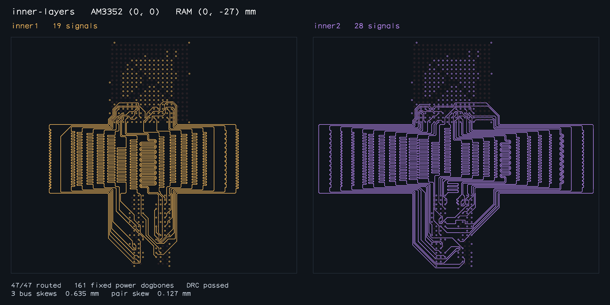

# Complete AM3352 CA/clock bus routed on inner1/inner2

The reproduction from PR #28 now routes all **47 signals** and passes independent
native connectivity, combined copper DRC, exterior pair coupling, all three
complete timing-bus skews, and all three differential-pair skews. The 161 fixed
power dogbones and their provenance are unchanged.



The exporter writes this image only after all acceptance checks pass. The two
panels show the actual inner1 and inner2 signal copper, including top-layer
terminal escapes. No saved solution, moved terminal, removed constraint, or
fixture-specific routing branch is used by the solver.

## What changed

- With several timing buses sharing a carrier layer, ordinary-lane negotiation
  continues past a nearly complete assignment before entering via-site repair.
  A bounded stall still falls back to repair, retaining the best assignment and
  its matching layer input.
- Folded tuning candidates have a bounded allowance per lane and per partial
  attempt. One difficult lane cannot consume every later lane's allowance.
  Completed ordinary corrections survive the folded fallback, and larger
  length deficits are considered first.
- Multi-bus matching can explore wider interior tuning banks. Single-bus
  matching retains its existing bank-width choices; broadening those choices
  globally caused a regression in the right-hand inner-layer placement.

Two small physical-pocket tests fail on the original tuner and pass this fix:
12 independently tunable lanes must each receive search budget, and switching
to folded tuning must retain a completed small ordinary correction.

## Measured complete-bus result

Final-source run: **117.507 s**, **72,455 iterations**,
47/47 signals, 19 on inner1 and 28 on inner2. The original reproduction exhausted
800,000 iterations without a completed route. Native DRC checks all 208 traces
(161 fixed power + 47 signals), 53,383 segments and 255 vias.

| Timing group | Members | Total copper range (mm) | Skew (mm) | Limit (mm) |
| --- | ---: | --- | ---: | ---: |
| DDR_BYTE0 | 11 | 61.470222–62.105222 | 0.635000 | 0.635 |
| DDR_BYTE1 | 11 | 53.729663–54.364663 | 0.635000 | 0.635 |
| DDR_ADDR_CTRL_CK | 24 | 74.970173–75.605173 | 0.635000 | 0.635 |
| pair_0 | 2 | 61.470222–61.490886 | 0.020663 | 0.127 |
| pair_1 | 2 | 53.729663–53.856663 | 0.127000 | 0.127 |
| pair_2 | 2 | 74.970173–75.043003 | 0.072830 | 0.127 |

Measurements include the complete pad-to-pad planar copper, including terminal
escapes. Floating-point differences below the validator's existing epsilon are
shown rounded; no skew or clearance tolerance was relaxed. See [report.json](report.json)
for all lengths, memberships, provenance checks and native DRC results.

**This is not full SBC DDR compliance.** The CA/clock routes are approximately
75 mm long, exceeding the SBC's 63.5 mm absolute ceiling. The bus API models
relative skew here; absolute length limits, stackup/impedance, return paths,
package/via delays and signal integrity still require board-level validation.
The existing SBC copper has not been replaced or published by this change.

## Original eight-placement regression

| Sample / fresh snapshot | Signals / native DRC | BYTE0 / BYTE1 skew (mm) | DQS0 / DQS1 / CK skew (mm) | Solver time |
| --- | --- | --- | --- | ---: |
| [control](baseline/control-solved.png) | 47/47 / Pass | 0.635000 / 0.635000 | 0.077868 / 0.126884 / 0.072830 | 25.439 s |
| [right](baseline/right-solved.png) | 47/47 / Pass | 0.635000 / 0.635000 | 0.096047 / 0.121802 / 0.102644 | 23.439 s |
| [left](baseline/left-solved.png) | 47/47 / Pass | 0.635000 / 0.635000 | 0.010514 / 0.127000 / 0.105429 | 30.986 s |
| [above](baseline/above-solved.png) | 47/47 / Pass | 0.635000 / 0.635000 | 0.127000 / 0.127000 / 0.127000 | 38.137 s |
| [inner-layers](baseline/inner-layers-solved.png) | 47/47 / Pass | 0.635000 / 0.635000 | 0.077868 / 0.126884 / 0.127000 | 37.947 s |
| [inner-layers-right](baseline/inner-layers-right-solved.png) | 47/47 / Pass | 0.635000 / 0.635000 | 0.123649 / 0.127000 / 0.127000 | 46.559 s |
| [inner-layers-left](baseline/inner-layers-left-solved.png) | 47/47 / Pass | 0.635000 / 0.635000 | 0.127000 / 0.127000 / 0.105429 | 65.888 s |
| [inner-layers-above](baseline/inner-layers-above-solved.png) | 47/47 / Pass | 0.635000 / 0.635000 | 0.127000 / 0.127000 / 0.127000 | 82.101 s |

[Full machine-readable baseline results](baseline-report.json).

All eight cases retain the original two byte-bus constraints and three pairs;
they are regression coverage, not additional complete CA/clock compliance tests.
Every case passes 47/47 connectivity, native combined DRC, the configured full
pad-to-pad skews, exterior coupling and immutable power checks. Fresh successful
snapshots for every case were individually inspected. The snapshot exporter
refuses to write any artifacts unless every declared case passes.

Measured 2026-10-04. Timings are from Bun 1.4.2 on Linux x86_64 and depend on machine/load. The original
60-second CI limit already timed out on the unmodified parent branch. CI now
allows 120 seconds per original placement and 180 seconds per complete-CA case,
without weakening connectivity, copper, coupling or length checks.

## Reproduce

```sh
bun run typecheck
bun test
bun run test:package
./benchmark.sh --timeout-seconds 120 --require-all-solved
bun scripts/repro-am3352-ca-bus.ts --timeout-seconds 180
bun scripts/snapshot-am3352-ca-routed.ts docs/routed-am3352-complete-ca 180
bun scripts/snapshot-routed-am3352.ts /tmp/am3352-routed 180
```

The reproduction runs the original baseline and complete-CA input in separate
processes and exits nonzero if either fails. Its input geometry/fixed-copper hash
excluding only bus constraints remains
`95420a05589961b0bcd1d8eadbf68705c52ed6adc8426f47f0cbd9a8f1289c24`.
