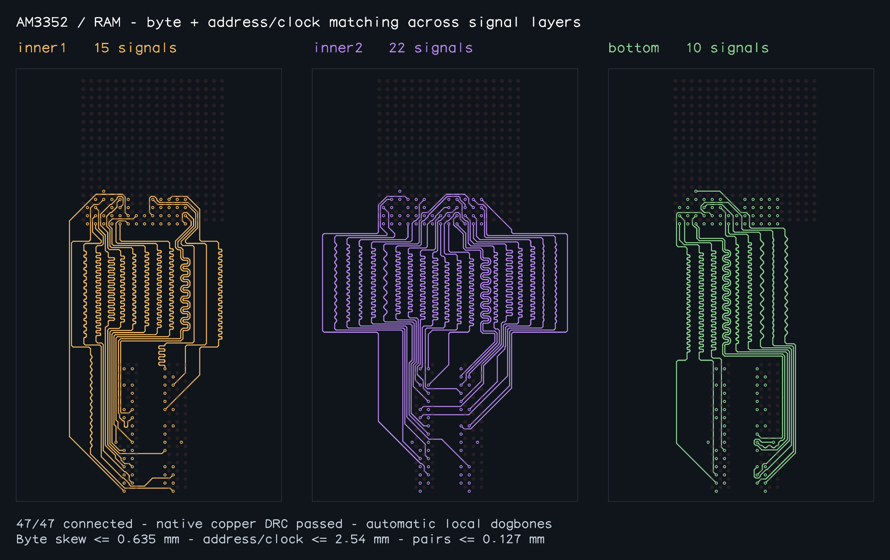

# Matching buses across carrier layers

A matching bus constrains total copper length; it does not require every member
on the same carrier layer. The pipeline keeps differential partners together,
respects explicit allowed layers and immutable existing fanouts, and prefers
co-locating small buses only when the allocation permits it. Retries can split
those buses. Matching remains global across all participating layers.

## Expanded core AM3352/RAM example

This input uses the native core pad/obstacle fixture with two byte/strobe buses
and one 24-signal address/clock matching bus. Routes are computed from pads;
there is no saved route geometry. Automatic local dogbones reach the selected
carrier layer, with no intermediate routing vias.

- 47/47 signals connected in 16.424 seconds on the local machine.
- Carrier allocation: inner1 15, inner2 22, bottom 10 signals.
- Byte bus total skew: 0.635 / 0.635 mm; address/clock total skew: 2.540 mm.
- DQS0 / DQS1 / clock skew: 0.127 / 0.118 / 0.050 mm, within 0.127 mm.
- Published native trace-overlap and self-short checks pass, including via lands.
- Differential pair coupling and conventional-angle measurements pass.

The [measurement report](report.json) includes all bus and pair copper lengths,
spacing measurements, detour ratios, and bounds. The solver regression validates
connectivity, matching, immutable input, carrier layers, local via count, and
native copper DRC before the exporter writes either PNG or SVG.

This is not a full electrical DDR signoff. Total planar length is 1,767.185 mm,
above core's existing 1,550 mm compactness ceiling. Maximum/mean detour is
2.063 / 1.739, above core's 2.05 / 1.55 ceilings as well. Core's full integration
test therefore still needs further routing improvements. No quality gate is relaxed.

Reproduce with `bun scripts/snapshot-core-multilayer.ts`.

## Existing eight powered placements

The [placement gallery](../routed-am3352-placements/README.md) contains all eight
fully routed benchmark snapshots, including the four inner1/inner2-only cases.
They preserve all 161 supplied VCC/GND dogbones and measure pad-to-pad bus/pair
skew including fixed copper. Their DRC result uses the existing FanoutSolver
combined-copper validator; the expanded core case additionally exercises
`@tscircuit/checks` trace self-short checks with materialized via lands.
The existing coupled-pair correction path remains unchanged in this PR. Run `./benchmark.sh --require-all-solved` and
`bun scripts/snapshot-routed-am3352.ts docs/routed-am3352-placements 60`.

The final isolated benchmark passes **8/8 within 60 seconds per sample**. All
reported bus/pair skews include fixed fanouts; 161 power dogbones remain unchanged.

| Sample | Route time | Connected | Existing native DRC | Byte 0 / byte 1 skew | DQS0 / DQS1 / clock skew |
| --- | ---: | --- | --- | --- | --- |
| control | 12.178s | 47/47 | Pass | 0.635 / 0.635 mm | 0.078 / 0.127 / 0.073 mm |
| right | 11.878s | 47/47 | Pass | 0.635 / 0.635 mm | 0.096 / 0.122 / 0.103 mm |
| left | 16.165s | 47/47 | Pass | 0.635 / 0.635 mm | 0.011 / 0.127 / 0.105 mm |
| above | 24.613s | 47/47 | Pass | 0.635 / 0.635 mm | 0.127 / 0.127 / 0.127 mm |
| inner-layers | 22.548s | 47/47 | Pass | 0.635 / 0.635 mm | 0.078 / 0.127 / 0.127 mm |
| inner-layers-right | 28.706s | 47/47 | Pass | 0.635 / 0.635 mm | 0.124 / 0.127 / 0.127 mm |
| inner-layers-left | 39.298s | 47/47 | Pass | 0.635 / 0.635 mm | 0.127 / 0.127 / 0.105 mm |
| inner-layers-above | 50.063s | 47/47 | Pass | 0.635 / 0.635 mm | 0.127 / 0.127 / 0.127 mm |

[Compact benchmark report](placement-report.json). Measurements: macOS arm64, Bun 1.3.2.
